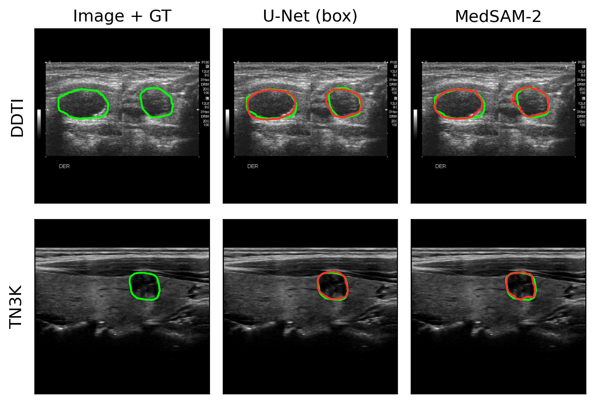

# Thyroid-Benchmark-Ultrasound

A cross-dataset benchmark of **promptable foundation models** and **traditional
baselines** for thyroid-ultrasound nodule segmentation, across zero-shot,
few-shot (LoRA), and fully-supervised regimes.

> Companion code for the ThyroidBench study. This repository exists so the study
> can be **re-run**, not re-read: the reported numbers, tables and statistics are
> in the paper, and this is the pipeline that produced them. DDTI and TN3K
> reproduce end to end from a fresh clone; ThyroidXL, Stanford AIMI and the SAM3
> weights each need an access grant of their own. See
> [`CITATION.cff`](CITATION.cff) to cite.

- **5 foundation models:** SAM, SAM2, MedSAM, MedSAM-2, SAM3
- **3 traditional baselines:** U-Net (ResNet50), TransUNet (R50-ViT-B/16), nnU-Net v2
- **4 public datasets:** ThyroidXL, TN3K, DDTI, Stanford AIMI Cine-clip
- **Fixed seed 42.** Splits are grouped at the finest unit each release
  identifies: patient for ThyroidXL and DDTI, nodule cine-clip for Stanford
  AIMI, image for TN3K (neither of the last two publishes patient ids).
- Every model receives the same tight oracle box, so the comparison is matched in
  prompting.

---

## What the predictions look like



One representative test case per dataset, ground truth in green and prediction in
red: a fully-supervised box-conditioned U-Net and MedSAM-2 adapted with LoRA, both
given the same tight oracle box. Only the two openly redistributable datasets
(DDTI and TN3K) are shown — the gated datasets are covered by data-use agreements
and no pixel of them appears anywhere in this repository.

---

## Quickstart

```bash
git clone https://github.com/RodrigoMedellinRobles/Thyroid-Benchmark-Ultrasound.git
cd Thyroid-Benchmark-Ultrasound
python -m venv .venv && source .venv/bin/activate     # Python 3.11+
pip install -r requirements.txt
pip install -e .                                      # exposes the `thyroidbench` package
```

`requirements.txt` also lists the foundation-model packages, which are not on
PyPI: SAM2 and MedSAM-2 install from their upstream repositories at pinned revisions,
SAM at repository HEAD. Notebook `00_setup/00_get_open_datasets.ipynb` lists them
with the checkpoint each model needs; its install cell ships commented out, and
the five checkpoints are downloaded by hand into `pretrained_models/`.

Then, in order:

1. **Get the data.** Run the notebooks in [`00_setup/`](00_setup/) top to bottom.
   Notebook `00` downloads DDTI and TN3K and installs the foundation models.
   Notebook `01` is where you place your own approved copies of the two gated
   datasets, and it validates the placement before you go further. Notebooks `02`
   and `03` preprocess and build the splits.
2. **Check your setup in minutes, not hours.** Before launching anything long:
   ```bash
   python experiments/exp2_zeroshot/run.py --model sam2 --dataset ddti --limit 8
   ```
   That is inference on eight DDTI images. If it produces metrics, your
   environment, weights, preprocessing and splits are all wired correctly.
3. **Pick an experiment** and run its notebook (see below).

---

## How to run an experiment

**The notebook is the entry point.** Every experiment folder has the same shape:

```
experiments/exp1_fullsupervised/traditional_boxcond/
├── run.ipynb        <- open this and run it top to bottom. This is what you run.
├── run.py           the training / evaluation code the notebook calls; also usable
│                    directly from the command line (`python run.py --help`)
├── aggregate_*.py   folds the per-run outputs into the summary table for this
│   compute_stats.py experiment (bootstrap CIs, Wilcoxon tests). The notebook
│                    calls these at the end.
├── results/         ships EMPTY. Metric CSVs are written here as you run.
└── checkpoints/     ships EMPTY and is git-ignored. Model weights are written
                     here as you train; no weights are distributed, ours or upstream.
```

So: open `run.ipynb`, run it, and the numbers appear under `results/` and the
weights under `checkpoints/`. Nothing else is required, and nothing in `results/`
is shipped pre-filled — a table you see there is one your own run produced.

### What it costs to run

Reproducing every experiment is weeks of GPU time, and almost all of it is in two
of them. Reproducing a *single* experiment is usually a day or less.

| | Compute | Notes |
|---|---|---|
| Experiments 2, 4, 5, 6 and the post-hoc stratification | hours to ~2 days each | inference only, from the checkpoints Experiments 1 and 3 produce, which must be run first |
| Experiment 1 | ~1 day per dataset for nnU-Net; hours for U-Net / TransUNet | U-Net and TransUNet each sweep 5 learning rates internally |
| Experiment 3 | the long one — 64 training runs across 4 models x 4 datasets x 4 fractions, plus 32 optional CNN runs the paper does not report | start with a single cell before launching the sweep |

Developed on a single RTX PRO 6000 (96 GB). The foundation models at 1024 px are
the memory driver; `--batch_size` is the knob to turn if you have less. Every
training script takes `--max_epochs`, so any run can be cut to one epoch as a dry run.

---

## Experiments

| Folder | Paper | What it measures |
|---|---|---|
| `exp1_fullsupervised/traditional_imageonly` | Experiment 1 | Unconditioned U-Net / TransUNet / nnU-Net, no box channel (the reference the box-conditioned rows are measured against) |
| `exp1_fullsupervised/traditional_boxcond` | Experiment 1 | Box-conditioned U-Net / TransUNet / nnU-Net at 100% labels |
| `exp1_fullsupervised/foundation_lora` | Experiment 1 | Fully-supervised foundation ceiling (LoRA, f = 100%) |
| `exp2_zeroshot` | Experiment 2 | Zero-shot foundation models, tight oracle box |
| `exp3_fewshot_lora` | Experiment 3 | Few-shot LoRA data efficiency, f ∈ {5, 10, 25, 50}%. The f = 100% point of the same curve is the fully-supervised run in `exp1_fullsupervised/foundation_lora` |
| `exp4_crossdataset` | Experiment 4 | Cross-dataset transfer under matched prompting (traditional + foundation) |
| `exp5_boxsens` | Experiment 5 | Box-prompt sensitivity (tight vs. jittered boxes) |
| `exp6_cineclip_video` | Experiment 6 | Cine-clip frame-by-frame vs. video-mode propagation |
| `stratified_posthoc` | Discussion, Supp. S6 | Post-hoc stratification by ACR TI-RADS category and nodule size |

---

## Repository map

```
00_setup/          notebooks: download open data, place gated data, preprocess, make splits
00_setup/_lib/     the scripts those notebooks call (downloaders, preprocessors, split builder)
data/              splits/ (committed, open datasets only) and preprocessing_stats.json;
                   raw/ and processed/ are git-ignored
thyroidbench/      the importable package (datasets, models, metrics, losses, boxes, trainer, LoRA)
experiments/       one folder per experiment, each with run.ipynb / run.py / results/ / checkpoints/
analysis/          the aggregators that turn per-image CSVs into the paper's tables
assets/            the qualitative figure shown above
```

---

## Data access

| Dataset | Access | Where it comes from |
|---|---|---|
| **DDTI** | open | auto-download (`00_setup/00_get_open_datasets.ipynb`) |
| **TN3K** | open | auto-download (same notebook) |
| **ThyroidXL** | **gated** | request on Hugging Face; place your copy (`00_setup/01_place_gated_datasets.ipynb`) |
| **Stanford AIMI** | **gated** | request via Stanford AIMI portal + DUA; place your HDF5 (same notebook) |

The two gated datasets **cannot be redistributed** here for IRB / data-use-agreement
reasons. Notebook `01_place_gated_datasets.ipynb` shows exactly where to place your
approved copies and validates that you placed them correctly. Committed splits under
`data/splits/` cover the two open datasets only; the gated splits are regenerated
deterministically by `00_setup/03_make_splits.ipynb` (seed 42) once you have the data.

---

## What is *not* in this repo

- **Results.** No metric tables, no per-image outputs. The reported values are in
  the paper; the code here regenerates them.
- **Statistics conventions worth knowing before you compare numbers.** HD95 is
  measured between mask *contours*, in pixels on the 512x512 grid, and an
  undefined HD95 (an empty prediction) is scored at the image diagonal,
  sqrt(2)x512, before any averaging. Three of the four datasets publish no pixel
  spacing, so distances are not in millimetres and are comparable across datasets
  rather than physical.
- **Model weights / checkpoints** — none, neither ours nor upstream. Every experiment
  regenerates its own; foundation models load published weights you download into a
  git-ignored `pretrained_models/` folder (each wrapper in `thyroidbench/models/`
  documents the exact file it loads). Note that **SAM3 access is gated** and must be
  requested from its authors.
- **Image data** — no raw, preprocessed, or sample pixels from any of the four
  datasets, beyond the two open-dataset cases in the figure above.

---

## License and citation

MIT, copyright Rodrigo Medellin-Robles — see [`LICENSE`](LICENSE) and [`CITATION.md`](CITATION.md). Every dataset
this benchmark evaluates is public, so the code is released permissively: re-run
it, extend it, disagree with it. If you use it, please cite the paper
([`CITATION.cff`](CITATION.cff)).

The datasets keep their own licences and data use agreements, two of them behind
an access request. Nothing here redistributes them, and this licence grants no
rights to the data.
